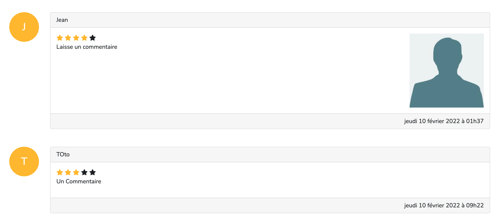

# Système d'avis en PHP

Nous allons construire un système d'avis en PHP. L'idée est de réaliser la page d'un restaurant avec la liste de ses avis.

## 1 - Intégration HTML / CSS

Pour le front, vous êtes libre d'utiliser ce que vous souhaitez, Bootstrap, Tailwind, sans framework, Scss... Cela doit juste ressembler au résultat final. On peut utiliser Font Awesome pour les petites étoiles (fas fa-star ) (https://cdnjs.cloudflare.com/ajax/libs/font-awesome/6.0.0/css/all.min.css).

Vous allez devoir donc intégrer le résultat suivant :


Concentrez-vous d'abord sur le front si vous préférez. De mon côté, j'ai utilisé Bootstrap avec des cards et des cols tout simplement (text-warning pour le jaune).

## 2 - Tableaux PHP

Pour commencer le PHP, il faudra créer un tableau PHP multidimensionnel (2 niveaux) contenant les avis :

- Nom
- Commentaire
- Note
- Date au format US (2022-02-09 11:43:12)

Il faudra lister les avis de manière dynamique :


On doit afficher la première lettre du nom dans l'avatar. On doit afficher le nombre d'étoiles par rapport à la note du commentaire.

Pour afficher la date correctement, il faudra sûrement regarder de [strtotime](https://www.php.net/manual/fr/function.strtotime.php) et [date](https://www.php.net/manual/fr/function.date). Les jours et les mois sont en français mais il y a possibilité de les traduire avec [notre meilleur ami](https://lucidar.me/fr/web-dev/in-php-how-to-display-date-in-french).

## 3 - Boucles PHP

Il faudra également utiliser les boucles et faire les bons calculs avec le tableau des avis pour que cette partie soit dynamique :


## 4 - Base de données

A cette étape, vous avez un bon résultat, et vous allez pouvoir stocker les commentaires dans une table d'une base de données. On va donc créer la table reviews avec :

- id (INT)
- name (VARCHAR)
- review (TEXT)
- note (INT)
- created_at (DATETIME ou TIMESTAMP)

Vous pouvez donc stocker les commentaires de votre tableau PHP dans la base de données et remplacer le tableau PHP par une requête SQL. N'oubliez pas PDO évidemment.

## 5 - Formulaire PHP

Vous devez maintenant faire fonctionner le formulaire afin de pouvoir ajouter un commentaire dans la base de données. Il faudra bien sûr vérifier les erreurs :


Si le formulaire est correctement rempli, on ajoute le commentaire dans la base de données et on affiche un message de succès. On prendra également soin de masquer le formulaire en mettant un lien pour rediriger vers la page index.php pour pouvoir ajouter à nouveau un commentaire.


## 6 - Upload

On va ajouter la possibilité pour les utilisateurs d'ajouter une photo en plus de leur avis. Il faudra donc modifier le formulaire pour ajouter un fichier (une image de 2mo maximum). La photo n'est pas obligatoire.


On ajoutera également une nouvelle colonne `image` de type `VARCHAR` (`null`) sur la table reviews car il faudra stocker le chemin de l'image afin de l'afficher facilement. Par exemple, on afficera l'image comme ceci :

```html

```

On devra stocker le chemin `uploads/review-123456.jpg` dans la colonne `image` au moment de l'`insert`.



## 7 - Sessions

On va ajouter une partie session sur le projet. On ajoutera un lien pour se connecter en haut à droite de la page.


Le lien aménera vers une nouvelle page login.php qui se contentera d'ajouter un prénom dans la session. On redirige ensuite directement sur la page index.php. Ce n'est pas un formulaire, ajoutez simplement le prénom dans la session, au plus simple.

Sur la page index.php, on va maintenant pouvoir vérifier si un prénom est présent dans la session, si c'est le cas, on affichera ce prénom avec un avatar en haut à droite à la place du nouveau lien.


On pré-remplira également le champ prénom quand l'utilisateur essaye d'ajouter un commentaire (voir l'attribut readonly).


On ajoutera ensuite un lien logout.php au clic sur l'avatar. Sur cette page, on se contentera de supprimer le prénom de la session puis de rediriger à nouveau vers index.php
